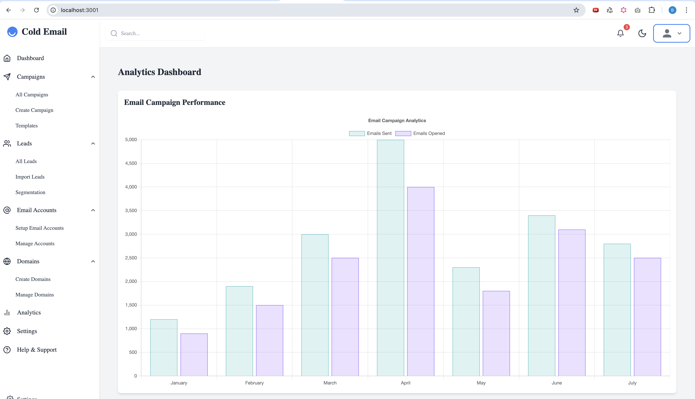

# AmazingMail - Cold Email System

This is a [Next.js](https://nextjs.org) project bootstrapped with [`create-next-app`](https://nextjs.org/docs/app/api-reference/cli/create-next-app).


## Overview
AmazingMail is a cold email system that empowers users to manage and automate their email outreach efforts effectively. With its user-friendly interface and powerful features, AmazingMail is designed to help businesses and marketers maximize their cold emailing strategies.

## Getting Started

First, set up your environment variables:

1. In the `frontend` directory, create a `.env` file with the following content:
   ```
   NEXT_PUBLIC_SUPABASE_URL=your_supabase_project_url
   NEXT_PUBLIC_SUPABASE_ANON_KEY=your_supabase_anon_key
   ```

2. In the `backend` directory, create a `.env` file with the following content:
   ```
   SUPABASE_URL=your_supabase_project_url
   SUPABASE_SERVICE_ROLE_KEY=your_supabase_service_role_key
   ```

Replace the placeholder values with your actual Supabase project URL, anon key, and service role key.

Then, run the development server:

```bash
npm run dev
# or
yarn dev
# or
pnpm dev
# or
bun dev
```

Open [http://localhost:3000](http://localhost:3000) with your browser to see the result.

You can start editing the page by modifying `app/page.tsx`. The page auto-updates as you edit the file.

## Features

- **User-Friendly Interface:** Intuitive design for easy navigation and management of email campaigns.
- **Integration Capabilities:** Seamlessly connects with popular email service providers for hassle-free email sending.
- **Customizable Email Templates:** Create and tailor email templates to align with your brand and messaging strategies.
- **Tracking and Analytics:** Monitor key metrics such as open rates, click rates, and overall campaign performance to make informed decisions.
- **Advanced Email List Management:** Organize and segment your email lists to target specific audiences effectively.
- **A/B Testing Features:** Experiment with different email strategies to optimize outreach based on performance data.
- **Domain Name Management:** Spin up domain names for your email campaigns to enhance deliverability and brand recognition.
- **Server Creation for Cold Email:** Set up dedicated servers for cold emailing, ensuring compliance with best practices and improving reliability.

## Screenshots



## License

This project is licensed under the MIT License. See the LICENSE file for more details.

